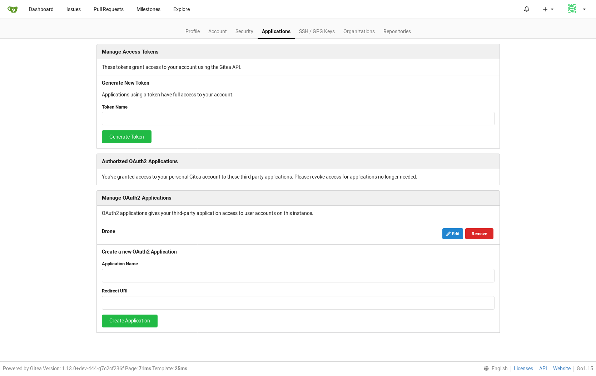

# A self-service Continuous Integration platform
## 1. Get Gitea CLIENT_ID and CLIENT_SECRET for application Drone

- Log in https://gitea.k8s.europe
- On user **[ Settings ]** click on **[ Applications ]** tab



- On frame **[  Manage OAuth2 Applications ]** click on **[ Edit ]** for application **Drone**


- Click on **[ Regenerate Secret ]**


- Copy values for :
  - Client ID : **153aac09-8967-4568-9574-7f035df84d02**
  - Client Secret : **3Z3mGJTGe6kkAMlnwYcURD9G9ARGNMANCP6XkJf-Fgk=**

- And click **[ Save ]**

> These values will be used during Drone installation for linking Drone with Gitea 

## 2. Drone installation
Move to ansible directory (assuming git repo is installed in ~/k8s_components) and run the playbook drone.yml.
```
cd ~/k8s_components/ansible
export ANSIBLE_CONFIG=~/.ansible/ansible.cfg
ansible-playbook -i inventories/demo drone.yml --extra-vars="operation=install GITEA_CLIENT_ID=153aac09-8967-4568-9574-7f035df84d02  GITEA_CLIENT_SECRET=3Z3mGJTGe6kkAMlnwYcURD9G9ARGNMANCP6XkJf-Fgk=" -u vagrant
```
```

PLAY [kubeadmin] ********************************************************************************

TASK [Gathering Facts] **************************************************************************
ok: [paris.europe]

...
...

PLAY RECAP **************************************************************************************
paris.europe               : ok=41   changed=29    unreachable=0    failed=0   

```
## 3. Access Drone : installation

Open your browser (Firefox in our case) at https://drone.k8s.europe 

Note : The certificate is a self certificate generated usng cfssl. 

- Click on **[ Advanced... ]** 
- Click on **[ Accept the Risk and Continue ]**


- Click **[ Authorize Application ]**

> When installation is complete, you are redirect to the signin page.


## 4. Using --extra-vars to customize installation
The playbook accepts 2 extra vars :
- operation : could be either "install" or "delete"
- task : could be either "all" or the task to execute :
    - helm : install helm tool
    - repo : add helm repo and update
    - namespace : create namespace
    - stolon : configure and install a HA postgresql database using stolon architecture 
    - cfssl : configure certificates
    - drone : configure and install Drone
    - drone-runner : configure and install Drone Runner

Examples :

Step by step installation :
```
ansible-playbook -i inventories/demo drone.yml --extra-vars="operation=install task=helm" -u vagrant
ansible-playbook -i inventories/demo drone.yml --extra-vars="operation=install task=drone" -u vagrant
ansible-playbook -i inventories/demo drone.yml --extra-vars="operation=install task=namespace" -u vagrant
ansible-playbook -i inventories/demo drone.yml --extra-vars="operation=install task=stolon" -u vagrant
ansible-playbook -i inventories/demo drone.yml --extra-vars="operation=install task=cfssl" -u vagrant
ansible-playbook -i inventories/demo drone.yml --extra-vars="operation=install task=drone GITEA_CLIENT_ID=153aac09-8967-4568-9574-7f035df84d02  GITEA_CLIENT_SECRET=3Z3mGJTGe6kkAMlnwYcURD9G9ARGNMANCP6XkJf-Fgk=" -u vagrant
ansible-playbook -i inventories/demo drone.yml --extra-vars="operation=install task=drone-runner" -u vagrant
```
Delete Drone & Drone Runner :
```
ansible-playbook -i inventories/demo drone.yml --extra-vars="operation=delete task=drone-runner" -u vagrant
ansible-playbook -i inventories/demo drone.yml --extra-vars="operation=delete task=drone" -u vagrant
```
Delete installation :
```
ansible-playbook -i inventories/demo drone.yml --extra-vars="operation=delete task=all" -u vagrant
```
## 5. Drone settings
Installation settings are configured in **inventories/demo/group_vars/roles/drone.yml** file :

```
# drone configuration

drone:
  namespace: drone

  runner:
    rpc_skip_verify: true # if using self signed certificates

  gitea:
    skip_verify: true # if using self signed certificates
    server: https://gitea.k8s.europe

  persistence:
    size: 200Mi

  db:
    name: drone
    user: drone
    password: password
    host: drone-stolon-proxy
    port: 5432

  stolon:
    release: drone-stolon
    superuserUsername: postgres
    superuserPassword: password
    replicationPassword: password

    persistence:
      size: 400Mi
    keeper:
      replicaCount: 2
    proxy:
      replicaCount: 2

  ca:
    csr_C: EU
    csr_L: paris
    csr_ST: france
  ui:
    csr_CN: drone.k8s.europe
    host: drone.k8s.europe
```
