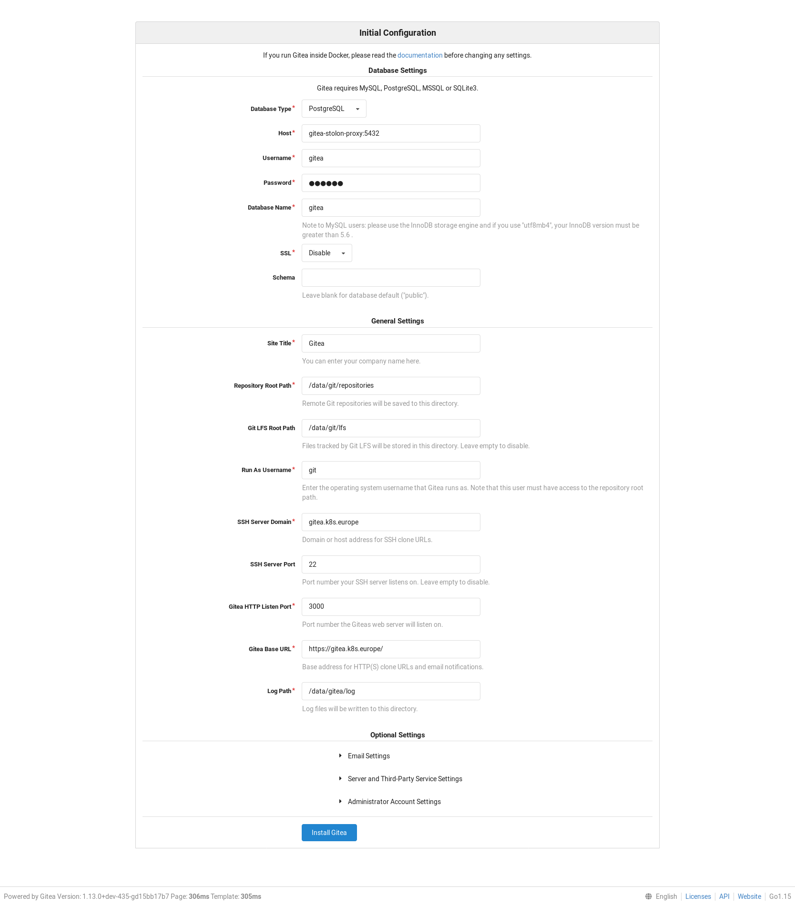
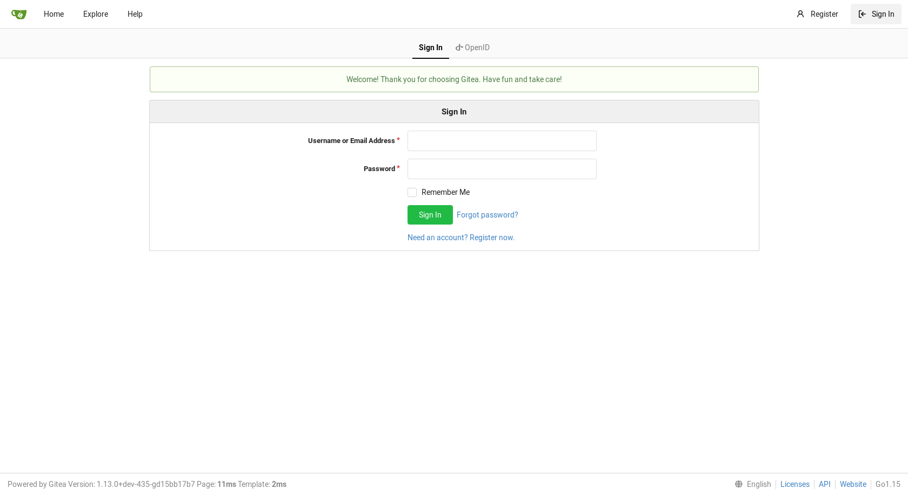
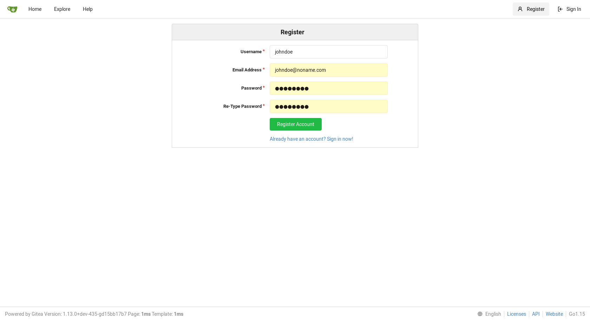
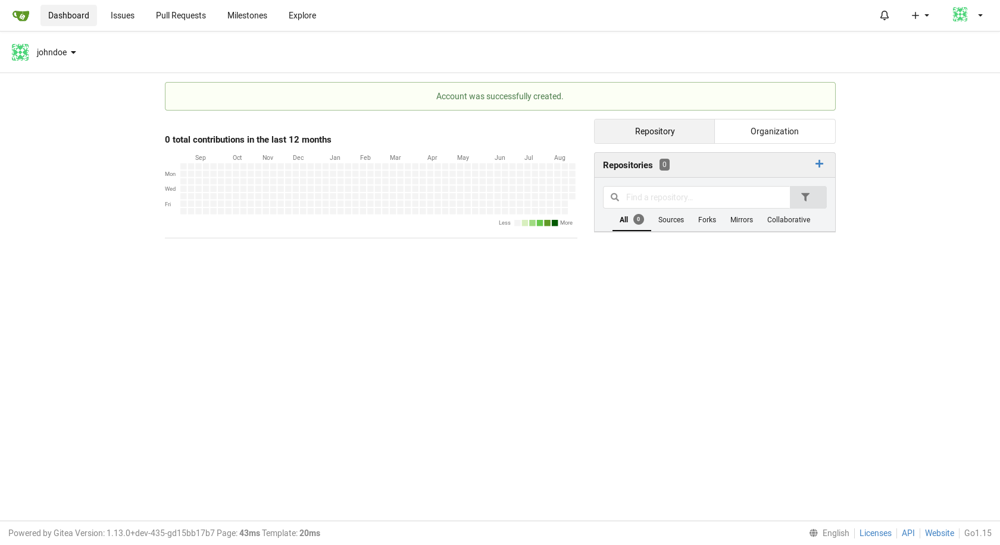
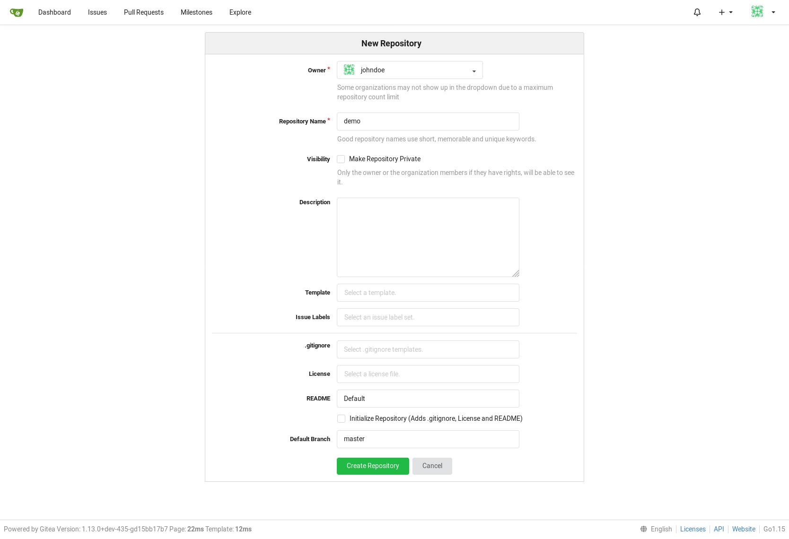
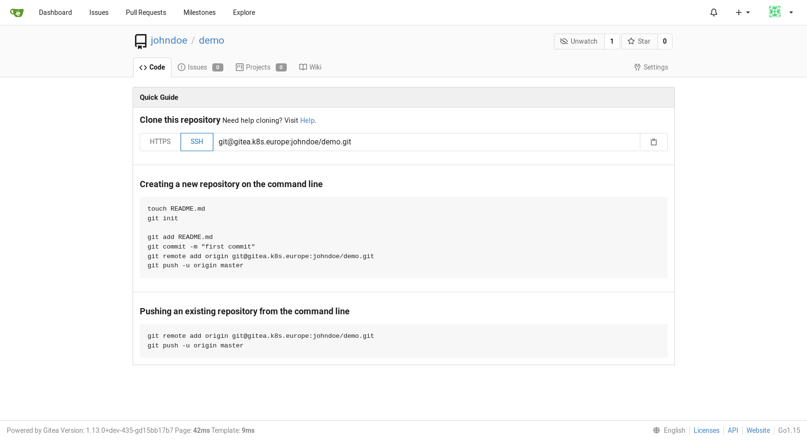
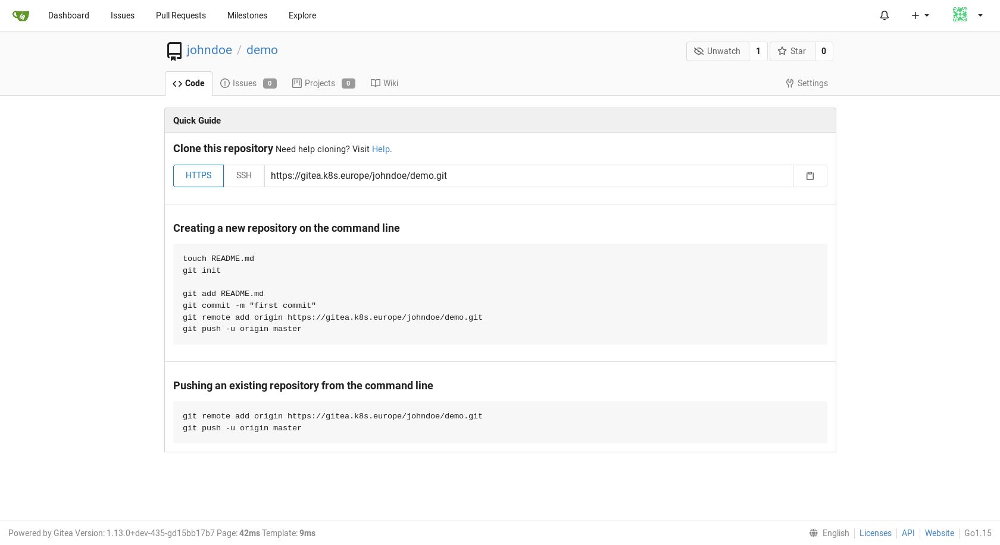

# A community managed lighweight code hosting
## 1. Gitea installation
Move to ansible directory (assuming git repo is installed in ~/k8s_components) and run the playbook gitea.yml.
```
cd ~/k8s_components/ansible
export ANSIBLE_CONFIG=~/.ansible/ansible.cfg
ansible-playbook -i inventories/demo gitea.yml --extra-vars="operation=install" -u vagrant
```
```

PLAY [kubeadmin] ********************************************************************************

TASK [Gathering Facts] **************************************************************************
ok: [paris.europe]

...
...

PLAY RECAP **************************************************************************************
paris.europe               : ok=34   changed=22    unreachable=0    failed=0   

```
## 2. Access Gitea : installation

Open your browser (Firefox in our case) at https://gitea.k8s.europe 

Note : The certificate is a self certificate generated usng cfssl. 

- Click on **[ Advanced... ]** 
- Click on **[ Accept the Risk and Continue ]**



- Click **[ Install Gitea ]**

> When installation is complete, you are redirect to the signin page.



## 3. Register new - admin - account

- Click **[ Need an account? Register now. ]**



- Click **[ Register account ]**

## 4. Add a new repository



- On the right **Repositories** frame, Click **[ + ]**



- Click on **[ SSH ]** to view the ssh uri : git@gitea.k8s.europe:johndoe/demo.git



- Click on **[ HTTPS ]** to view the https uri : https://gitea.k8s.europe/johndoe/demo.git

> In our case we are using self signed certificates. You need to add "git config --global **http.sslVerify false**" command



## 5. Using --extra-vars to customize installation
The playbook accepts 2 extra vars :
- operation : could be either "install" or "delete"
- task : could be either "all" or the task to execute :
    - helm : install helm tool
    - repo : add helm repo and update
    - namespace : create namespace
    - stolon : configure and install a HA postgresql database using stolon architecture 
    - cfssl : configure certificates
    - gitea : configure and install Gitea

Examples :

Step by step installation :
```
ansible-playbook -i inventories/demo gitea.yml --extra-vars="operation=install task=helm" -u vagrant
ansible-playbook -i inventories/demo gitea.yml --extra-vars="operation=install task=repo" -u vagrant
ansible-playbook -i inventories/demo gitea.yml --extra-vars="operation=install task=namespace" -u vagrant
ansible-playbook -i inventories/demo gitea.yml --extra-vars="operation=install task=stolon" -u vagrant
ansible-playbook -i inventories/demo gitea.yml --extra-vars="operation=install task=cfssl" -u vagrant
ansible-playbook -i inventories/demo gitea.yml --extra-vars="operation=install task=gitea" -u vagrant
```
Delete Gitea :
```
ansible-playbook -i inventories/demo gitea.yml --extra-vars="operation=delete task=gitea" -u vagrant
```
Delete installation :
```
ansible-playbook -i inventories/demo gitea.yml --extra-vars="operation=delete task=all" -u vagrant
```
## 6. Gitea settings
Installation settings are configured in **inventories/demo/group_vars/roles/gitea.yml** file :

```
# gitea configuration

gitea:
  namespace: gitea

  app: Gitea
  domain: gitea.k8s.europe
  root_url: https://gitea.k8s.europe
  ssh_domain: gitea.k8s.europe
  ssh_external_ip: 192.168.10.190

  db:
    name: gitea
    user: gitea
    password: password

  stolon:
    release: gitea-stolon
    superuserUsername: postgres
    superuserPassword: password
    replicationPassword: password

    persistence:
      size: 2Gi
    keeper:
      replicaCount: 2
    proxy:
      replicaCount: 2

  ca:
    csr_C: EU
    csr_L: paris
    csr_ST: france
  ui:
    csr_CN: gitea.k8s.europe
    host: gitea.k8s.europe
```
