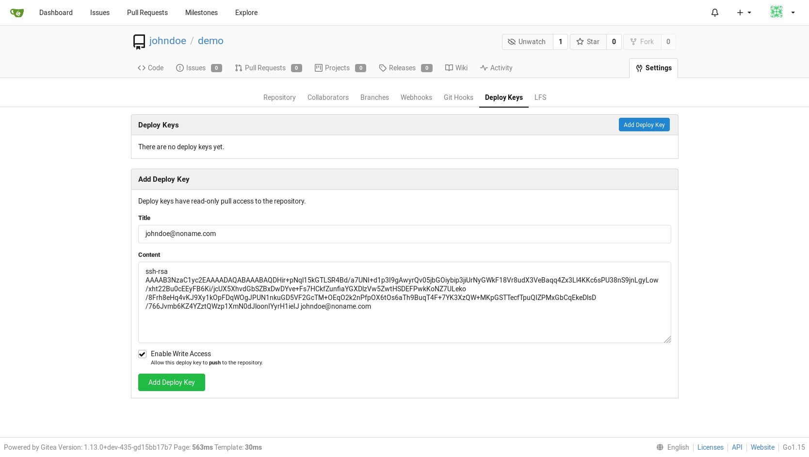

# A community managed lightweight code hosting
## 1. Gitea installation
Move to ansible directory (assuming git repo is installed in ~/k8s_components) and run the playbook gitea.yml.
```
cd ~/k8s_components/ansible
export ANSIBLE_CONFIG=~/.ansible/ansible.cfg
ansible-playbook -i inventories/demo gitea.yml --extra-vars="operation=install" -u vagrant
```
```

PLAY [kubeadmin] ********************************************************************************

TASK [Gathering Facts] **************************************************************************
ok: [paris.europe]

...
...

PLAY RECAP **************************************************************************************
paris.europe               : ok=34   changed=22    unreachable=0    failed=0   

```
## 2. Access Gitea : installation

Open your browser (Firefox in our case) at https://gitea.k8s.europe 

Note : The certificate is a self certificate generated usng cfssl. 

- Click on **[ Advanced... ]** 
- Click on **[ Accept the Risk and Continue ]**


- Click **[ Install Gitea ]**

> When installation is complete, you are redirect to the signin page.


## 3. Register new - admin - account

- Click **[ Need an account? Register now. ]**


- Click **[ Register account ]**

## 4. Add a new repository


- On the right **Repositories** frame, Click **[ + ]**


- Click on **[ SSH ]** to view the ssh uri : git@gitea.k8s.europe:johndoe/demo.git


- Click on **[ HTTPS ]** to view the https uri : https://gitea.k8s.europe/johndoe/demo.git

> In our case we are using self signed certificates. You need to add "git config --global **http.sslVerify false**" command


## 5. Create your local repository
On your local machine, create a local repository /tmp/demo, add a content README.md and push to gitea repo gitea.k8s.europe/johndoe/demo.git :
```
mkdir -p /tmp/demo
cd /tmp/demo
touch README.md
git init
git add README.md
git commit -m "first commit"
git remote add origin https://gitea.k8s.europe/johndoe/demo.git
git config --global http.sslVerify false
git push -u origin master
Username for 'https://gitea.k8s.europe': johndoe
Password for 'https://johndoe@gitea.k8s.europe': 
```

- Click on your **[ demo ]** repository to view the changes :


> File README.md has been pushed

## 6. Use ssh to pull & push repo
### 6.1 Create your own key **id_rsa_gitea**

Generate the key :
```
ssh-keygen -t rsa -f ~/.ssh/id_rsa_gitea  -q -N "" -C "johndoe@noname.com"
```

Copy the content of the key :
```
cat ~/.ssh/id_rsa_gitea.pub
```
```
ssh-rsa AAAAB3NzaC1yc2EAAAADAQABAAABAQDHir+pNql15kGTLSR4Bd/a7UNI+d1p3I9gAwyrQv05jbGOiybip3jiUrNyGWkF18Vr8udX3VeBaqq4Zx3Ll4KKc6sPU38nS9jnLgyLow/xht22Bu0cEEyFB6Ki/jcUX5XhvdGbSZBxDwDYve+Fs7HCkfZunfiaYGXDlzVw5ZwtHSDEFPwkKoNZ7ULeko/8Frh8eHq4vKJ9Xy1kOpFDqWOgJPUN1nkuGD5VF2GcTM+OEqO2k2nPfpOX6tOs6aTh9BuqT4F+7YK3XzQW+MKpGSTTecfTpuQIZPMxGbCqEkeDlsD/766Jvmb6KZ4YZztQWzp1XmN0dJloonIYyrH1ieIJ johndoe@noname.com
```
### 6.2 Add a deploy key

On **demo** repository :
- Click on **[ Settings ]**
- Click on **[ Deploy Keys ]**
- Click on **[ Add Deploy Key ]**



- Validate **Enable Write Access**
- Click on **[ Add Deploy Key ]**


> The deploy key is added to the demo repository

### 6.3 Configure git for ssh login

Move to your local repository and configure your .git/config file :

```
cd /tmp/demo
cat << EOF> .git/config

[core]
  repositoryformatversion = 0
  filemode = true
  bare = false
  logallrefupdates = true
  sshCommand = ssh -i ~/.ssh/id_rsa_gitea

[user]
  name = johndoe
  email = johndoe@noname.com

[remote "origin"]
  url = git@gitea.k8s.europe:johndoe/demo.git
  fetch = +refs/heads/*:refs/remotes/origin/*

[branch "master"]
  remote = origin
  merge = refs/heads/master

EOF
```

### 6.4 Change README.md content on Gitea

- Add an "Hello World" title :


- Click on **[ Commit Changes ]**


### 6.5 Synchronize the local repository
Move to your local repository and pull :
```
cd /tmp/demo
git pull
more README.me
```
```
# Hello World
```


## 7. Using --extra-vars to customize installation
The playbook accepts 2 extra vars :
- operation : could be either "install" or "delete"
- task : could be either "all" or the task to execute :
    - helm : install helm tool
    - repo : add helm repo and update
    - namespace : create namespace
    - stolon : configure and install a HA postgresql database using stolon architecture 
    - cfssl : configure certificates
    - gitea : configure and install Gitea

Examples :

Step by step installation :
```
ansible-playbook -i inventories/demo gitea.yml --extra-vars="operation=install task=helm" -u vagrant
ansible-playbook -i inventories/demo gitea.yml --extra-vars="operation=install task=repo" -u vagrant
ansible-playbook -i inventories/demo gitea.yml --extra-vars="operation=install task=namespace" -u vagrant
ansible-playbook -i inventories/demo gitea.yml --extra-vars="operation=install task=stolon" -u vagrant
ansible-playbook -i inventories/demo gitea.yml --extra-vars="operation=install task=cfssl" -u vagrant
ansible-playbook -i inventories/demo gitea.yml --extra-vars="operation=install task=gitea" -u vagrant
```
Delete Gitea :
```
ansible-playbook -i inventories/demo gitea.yml --extra-vars="operation=delete task=gitea" -u vagrant
```
Delete installation :
```
ansible-playbook -i inventories/demo gitea.yml --extra-vars="operation=delete task=all" -u vagrant
```
## 8. Gitea settings
Installation settings are configured in **inventories/demo/group_vars/roles/gitea.yml** file :

```
# gitea configuration

gitea:
  namespace: gitea

  app: Gitea
  domain: gitea.k8s.europe
  root_url: https://gitea.k8s.europe
  ssh_domain: gitea.k8s.europe
  ssh_external_ip: 192.168.10.190

  db:
    name: gitea
    user: gitea
    password: password

  stolon:
    release: gitea-stolon
    superuserUsername: postgres
    superuserPassword: password
    replicationPassword: password

    persistence:
      size: 2Gi
    keeper:
      replicaCount: 2
    proxy:
      replicaCount: 2

  ca:
    csr_C: EU
    csr_L: paris
    csr_ST: france
  ui:
    csr_CN: gitea.k8s.europe
    host: gitea.k8s.europe
```
