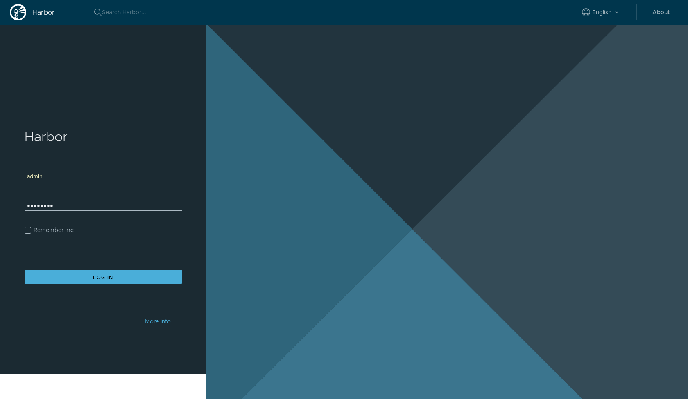
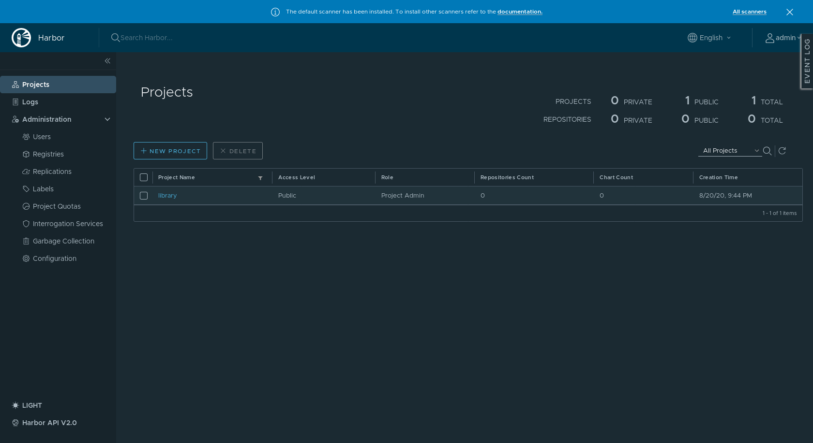

# A trusted cloud native repository for Kubernetes
## 1. Harbor installation
Move to ansible directory (assuming git repo is installed in ~/k8s_components) and run the playbook harbor.yml.
```
cd ~/k8s_components/ansible
export ANSIBLE_CONFIG=~/.ansible/ansible.cfg
ansible-playbook -i inventories/demo harbor.yml --extra-vars="operation=install" -u vagrant
```
```

PLAY [kubeadmin] ********************************************************************************

TASK [Gathering Facts] **************************************************************************
ok: [paris.europe]

...
...

PLAY RECAP **************************************************************************************
paris.europe               : ok=22   changed=12    unreachable=0    failed=0   

```
## 2. Access Harbor : login

Open your browser (Firefox in our case) at https://harbor.k8s.europe 

Note : The certificate is a self certificate generated usng cfssl. 

- Click on **[ Advanced... ]** 
- Click on **[ Accept the Risk and Continue ]**



- Click on **[ LOG IN ]** 



> Now you are ready to use Harbor

## 3. Using --extra-vars to customize installation
The playbook accepts 2 extra vars :
- operation : could be either "install" or "delete"
- task : could be either "all" or the task to execute :
    - helm : install helm tool
    - repo : pull the operator locally on kubeadmin host
    - namespace : create namespace
    - cfssl : configure certificates
    - harbor : configure and install Harbor

Examples :

Step by step installation :
```
ansible-playbook -i inventories/demo harbor.yml --extra-vars="operation=install task=helm" -u vagrant
ansible-playbook -i inventories/demo harbor.yml --extra-vars="operation=install task=repo" -u vagrant
ansible-playbook -i inventories/demo harbor.yml --extra-vars="operation=install task=namespace" -u vagrant
ansible-playbook -i inventories/demo harbor.yml --extra-vars="operation=install task=cfssl" -u vagrant
ansible-playbook -i inventories/demo harbor.yml --extra-vars="operation=install task=harbor" -u vagrant
```
Delete Harbor :
```
ansible-playbook -i inventories/demo harbor.yml --extra-vars="operation=delete task=harbor" -u vagrant
```
Delete installation :
```
ansible-playbook -i inventories/demo harbor.yml --extra-vars="operation=delete task=all" -u vagrant
```
## 4. Harbor settings
Installation settings are configured in **inventories/demo/group_vars/roles/harbor.yml** file :

```
# harbor configuration

harbor:
  namespace: harbor
  release: harbor-repo
  admin:
    password: password
  persistence:
    enable: true
    size:
      registry: 1Gi # dafault is 5Gi
      chartmuseum: 1Gi # default is 5Gi
      jobservice: 200Mi # default is 1Gi
      database: 200Mi # default is 1Gi
      redis: 200Mi # default is 1Gi
      trivy: 1Gi # dafault is 5Gi

  ca:
    csr_C: EU
    csr_L: paris
    csr_ST: france
  ui:
    csr_CN: harbor.k8s.europe
    host: harbor.k8s.europe
  notary:
    csr_CN: notary.k8s.europe
    host: notary.k8s.europe
```
