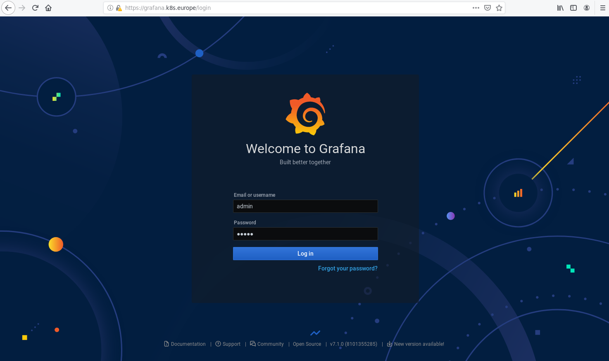
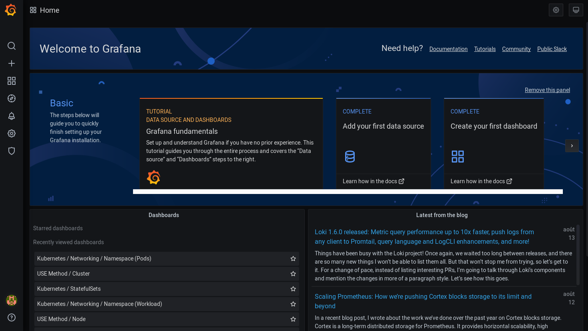
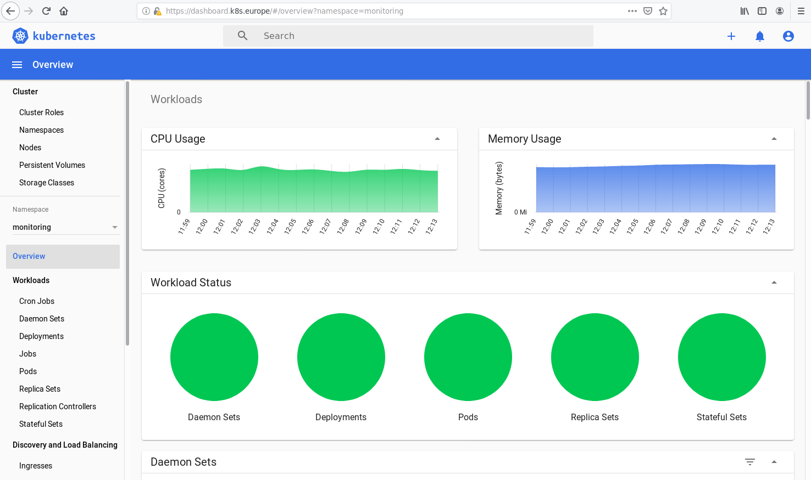

# Default monitoring for Kubernetes
## 1. Prometheus (and grafana) installation
Move to ansible directory (assuming git repo is installed in ~/k8s_components) and run the playbook prometheus.yml.
```
cd ~/k8s_components/ansible
export ANSIBLE_CONFIG=~/.ansible/ansible.cfg
ansible-playbook -i inventories/demo prometheus.yml --extra-vars="operation=install" -u vagrant
```
```

PLAY [kubeadmin] ********************************************************************************

TASK [Gathering Facts] **************************************************************************
ok: [paris.europe]

...
...

PLAY RECAP **************************************************************************************
paris.europe               : ok=13   changed=7    unreachable=0    failed=0   

```
## 2. Access Grafana dashboard : login

Open your browser (Firefox in our case) at https://grafana.k8s.europe 

Note : The certificate is a self certificate generated usng cfssl. 

- Click on [Advanced...] 
- Click on [Accept the Risk and Continue]



- Login as admin/admin
- Click [Log in]


- Change your password
- Click [Submit]



> You can now manage your Grafana dashboards 

If you log in to Kubernetes dashboard at https://kubernetes.k8s.europe and choose "monitoring" as namespace. You will see on top of the page new metrics "CPU Usage" and "Memory Usage" :



## 3. Using --extra-vars to customize installation
The playbook accepts 2 extra vars :
- operation : could be either "install" or "delete"
- task : could be either "all" or the task to execute :
    - repo : pull the operator locally on kubeadmin host
    - operator : configure and install the operator
    - grafana-ui : configure and install the Grafana dashboard

Examples :

Step by step installation :
```
ansible-playbook -i inventories/demo prometheus.yml --extra-vars="operation=install task=repo" -u vagrant
ansible-playbook -i inventories/demo prometheus.yml --extra-vars="operation=install task=operator" -u vagrant
ansible-playbook -i inventories/demo prometheus.yml --extra-vars="operation=install task=grafana-ui" -u vagrant
```
Delete Grafana dashboard :
```
ansible-playbook -i inventories/demo prometheus.yml --extra-vars="operation=delete task=grafana-ui" -u vagrant
```
Delete installation :
```
ansible-playbook -i inventories/demo prometheus.yml --extra-vars="operation=delete task=all" -u vagrant
```

## 4. Prometheus settings
Installation settings are configured in **inventories/demo/group_vars/roles/prometheus.yml** file :

```
# grafana configuration

grafana:
  ca:
    csr_C: EU
    csr_L: paris
    csr_ST: france
  ui:
    csr_CN: grafana.k8s.europe
    host: grafana.k8s.europe
```
