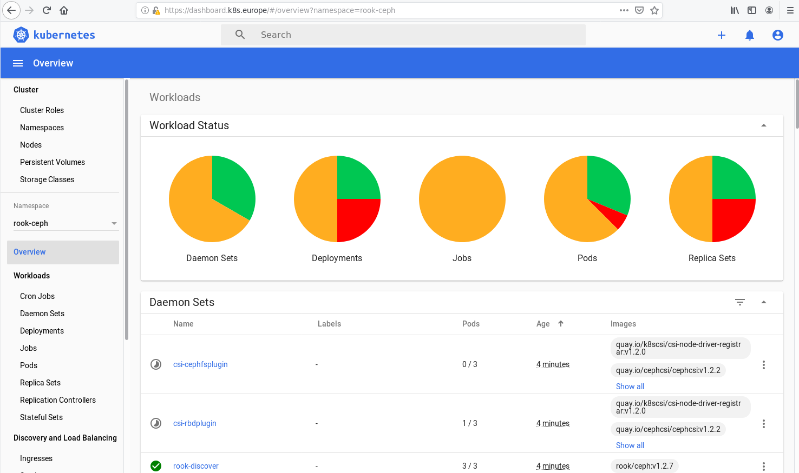
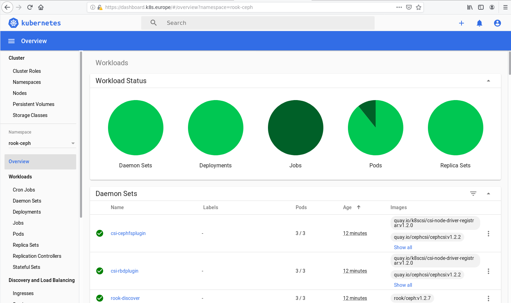
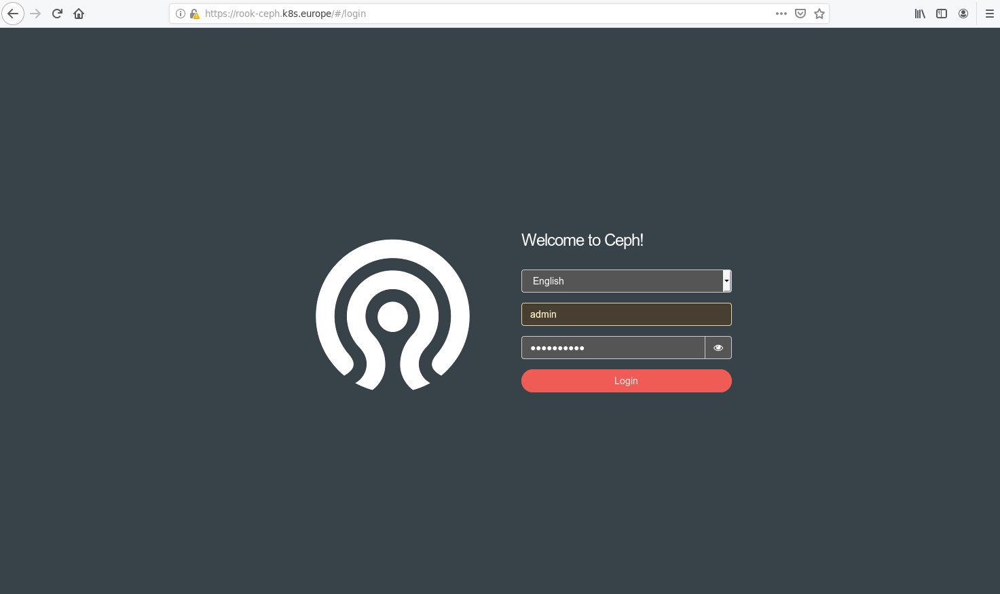
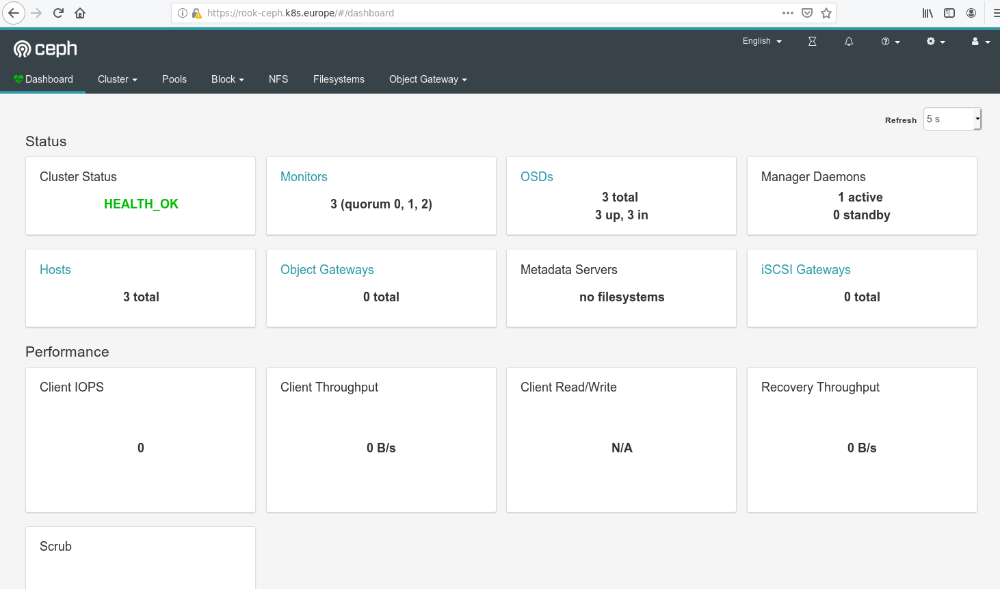

# Distributed storage and default storage class for Kubernetes

Two steps installation :
- First we need to prepare the nodes that will host rook-ceph data
- Second we will install rook-ceph

## 1. Rook-ceph nodes installation
Move to ansible directory (assuming git repo is installed in ~/k8s_components) and run the playbook prometheus.yml.
```
cd ~/k8s_components/ansible
export ANSIBLE_CONFIG=~/.ansible/ansible.cfg
ansible-playbook -i inventories/demo rook-ceph-nodes.yml --extra-vars="operation=install" -u vagrant
```
```

PLAY [rook-ceph-nodes] **************************************************************************

TASK [Gathering Facts] **************************************************************************
ok: [lisboa.europe]
ok: [roma.europe]
ok: [madrid.europe]

...
...

PLAY RECAP **************************************************************************************
lisboa.europe              : ok=5    changed=2    unreachable=0    failed=0   
madrid.europe              : ok=5    changed=2    unreachable=0    failed=0   
roma.europe                : ok=5    changed=2    unreachable=0    failed=0   

```

## 2. Rook-ceph installation
Move to ansible directory (assuming git repo is installed in ~/k8s_components) and run the playbook rook-ceph.yml.
```
cd ~/k8s_components/ansible
export ANSIBLE_CONFIG=~/.ansible/ansible.cfg
ansible-playbook -i inventories/demo rook-ceph.yml --extra-vars="operation=install" -u vagrant
```
```

PLAY [kubeadmin] ***************************************************************

TASK [Gathering Facts] *********************************************************
ok: [paris.europe]

...
...

PLAY RECAP *********************************************************************
paris.europe               : ok=23   changed=14   unreachable=0    failed=0   

```

> Installation takes a quite a long time (approx. 10 minutes on my computer).
You can follow the installation progress using either kubectl or kubernetes dashboard on namespace "rook-ceph".

- Follow the installation using the dashboard :



- After approx. 10 minutes it's done :



## 3. Verify rook-ceph installation
Connect the master node, log in as kubeadmin and execute kubectl command to check installtion.
```
ssh vagrant@192.168.10.10
sudo su - kubeadmin
kubectl get pods -o wide --namespace rook-ceph
```
```
NAME                                                      READY   STATUS      RESTARTS   AGE   IP              NODE            NOMINATED NODE   READINESS GATES
csi-cephfsplugin-8kjqd                                    3/3     Running     0          29m   192.168.10.12   roma.europe     <none>           <none>
csi-cephfsplugin-h5dhp                                    3/3     Running     0          29m   192.168.10.14   lisboa.europe   <none>           <none>
csi-cephfsplugin-nvkv5                                    3/3     Running     0          29m   192.168.10.13   madrid.europe   <none>           <none>
csi-cephfsplugin-provisioner-85979bcd-8vjsx               4/4     Running     0          29m   10.46.0.6       madrid.europe   <none>           <none>
csi-cephfsplugin-provisioner-85979bcd-b8kjr               4/4     Running     0          29m   10.40.0.8       roma.europe     <none>           <none>
csi-rbdplugin-lqkdv                                       3/3     Running     0          29m   192.168.10.13   madrid.europe   <none>           <none>
csi-rbdplugin-pjxvg                                       3/3     Running     0          29m   192.168.10.14   lisboa.europe   <none>           <none>
csi-rbdplugin-provisioner-66f64ff49c-2vp79                5/5     Running     0          29m   10.32.0.9       lisboa.europe   <none>           <none>
csi-rbdplugin-provisioner-66f64ff49c-nj5lj                5/5     Running     3          29m   10.40.0.7       roma.europe     <none>           <none>
csi-rbdplugin-vph5z                                       3/3     Running     0          29m   192.168.10.12   roma.europe     <none>           <none>
rook-ceph-crashcollector-lisboa.europe-85bb558f96-9lvpj   1/1     Running     0          19m   10.32.0.14      lisboa.europe   <none>           <none>
rook-ceph-crashcollector-madrid.europe-65c4b755df-rht7b   1/1     Running     0          21m   10.46.0.9       madrid.europe   <none>           <none>
rook-ceph-crashcollector-roma.europe-67cb447c97-hs2cf     1/1     Running     0          21m   10.40.0.12      roma.europe     <none>           <none>
rook-ceph-mgr-a-6bb77648c8-l8p2k                          1/1     Running     0          19m   10.32.0.11      lisboa.europe   <none>           <none>
rook-ceph-mon-a-c954cbcb7-gp7dp                           1/1     Running     0          22m   10.32.0.10      lisboa.europe   <none>           <none>
rook-ceph-mon-b-5db49b9f99-l9cnc                          1/1     Running     0          21m   10.40.0.10      roma.europe     <none>           <none>
rook-ceph-mon-c-9fc49f54d-q76qg                           1/1     Running     0          21m   10.46.0.7       madrid.europe   <none>           <none>
rook-ceph-operator-658dfb6cc4-9r7zz                       1/1     Running     0          31m   10.40.0.5       roma.europe     <none>           <none>
rook-ceph-osd-0-9bf5d7ff9-x5z6f                           1/1     Running     0          19m   10.46.0.8       madrid.europe   <none>           <none>
rook-ceph-osd-1-856cc4d589-pcl5x                          1/1     Running     0          19m   10.40.0.11      roma.europe     <none>           <none>
rook-ceph-osd-2-57d8cfddbb-m2h2s                          1/1     Running     0          19m   10.32.0.13      lisboa.europe   <none>           <none>
rook-ceph-osd-prepare-lisboa.europe-5jgkd                 0/1     Completed   0          19m   10.32.0.13      lisboa.europe   <none>           <none>
rook-ceph-osd-prepare-madrid.europe-4wbp7                 0/1     Completed   0          19m   10.46.0.8       madrid.europe   <none>           <none>
rook-ceph-osd-prepare-roma.europe-nth8w                   0/1     Completed   0          19m   10.40.0.11      roma.europe     <none>           <none>
rook-ceph-tools-55d5c49f79-sjd9t                          1/1     Running     0          31m   10.40.0.9       roma.europe     <none>           <none>
rook-discover-7c4sb                                       1/1     Running     0          29m   10.32.0.8       lisboa.europe   <none>           <none>
rook-discover-lmjhz                                       1/1     Running     0          29m   10.40.0.6       roma.europe     <none>           <none>
rook-discover-rnn9w                                       1/1     Running     0          29m   10.46.0.5       madrid.europe   <none>           <none>
```

```
kubectl -n rook-ceph exec $(kubectl -n rook-ceph get pod -l "app=rook-ceph-tools" -o jsonpath="{.items[0].metadata.name}") -- ceph osd status
```
```
+----+---------------+-------+-------+--------+---------+--------+---------+-----------+
| id |      host     |  used | avail | wr ops | wr data | rd ops | rd data |   state   |
+----+---------------+-------+-------+--------+---------+--------+---------+-----------+
| 0  | madrid.europe | 11.8G | 6534M |    0   |     0   |    0   |     0   | exists,up |
| 1  |  roma.europe  | 12.0G | 6281M |    0   |     0   |    0   |     0   | exists,up |
| 2  | lisboa.europe | 12.0G | 6339M |    0   |     0   |    0   |     0   | exists,up |
+----+---------------+-------+-------+--------+---------+--------+---------+-----------+
```
```
kubectl -n rook-ceph exec $(kubectl -n rook-ceph get pod -l "app=rook-ceph-tools" -o jsonpath="{.items[0].metadata.name}") -- ceph df
```
```
RAW STORAGE:
    CLASS     SIZE       AVAIL      USED       RAW USED     %RAW USED 
    hdd       55 GiB     19 GiB     36 GiB       36 GiB         65.76 
    TOTAL     55 GiB     19 GiB     36 GiB       36 GiB         65.76 
 
POOLS:
    POOL            ID     STORED     OBJECTS     USED     %USED     MAX AVAIL 
    replicapool      1        0 B           0      0 B         0       7.8 GiB 
```

## 4. Access the Rook-ceph dashboard : get password


Move to ansible directory (assuming git repo is installed in ~/k8s_components) and run the playbook rook-ceph.yml.
```
cd ~/k8s_components/ansible
export ANSIBLE_CONFIG=~/.ansible/ansible.cfg
ansible-playbook -i inventories/demo rook-ceph.yml --extra-vars="operation=check task=ui-login" -u vagrant
```
```
PLAY [kubeadmin] ********************************************************************************

TASK [Gathering Facts] **************************************************************************
ok: [paris.europe]

...
...

TASK [rook-ceph : copy and paste admin user password printed below] *****************************
ok: [paris.europe] => {
    "msg": "rLck1UeXPI"
}

PLAY RECAP **************************************************************************************
paris.europe               : ok=7    changed=3    unreachable=0    failed=0   

```

Copy/paste the content of msg (between quotes) :

```
rLck1UeXPI
```

## 5. Access the rook-ceph dashboard : login

Open your browser (Firefox in our case) at https://rook-ceph.k8s.europe 

Note : The certificate is a self certificate generated usng cfssl. 

- Click on [Advanced...] 
- Click on [Accept the Risk and Continue]



- Login as admin
- Password : **rLck1UeXPI** (copy your password)
- Click [Login]



> You can now view your Ceph dashboards 


## 6. Using --extra-vars to customize installation
The playbook accepts 2 extra vars :
- operation : could be either "install", "delete" or "check" (only for task "ui-login")
- task : could be either "all" or the task to execute :
    - repo : pull the operator locally on kubeadmin host
    - operator : configure and install the operator
    - cluster : configure and install the rook-ceph cluster
    - toolbox : install the rook-ceph toolbox
    - storage-class : instantiate the storage class defined as default storage class for Kubernetes
    - ui : configure and install the rook-ceph dashboard
    - ui-login : fetch the rook-ceph dashboard generated password (only for operation "check") 

Examples :

Step by step installation :
```
ansible-playbook -i inventories/demo rook-ceph.yml --extra-vars="operation=install task=repo" -u vagrant
ansible-playbook -i inventories/demo rook-ceph.yml --extra-vars="operation=install task=operator" -u vagrant
ansible-playbook -i inventories/demo rook-ceph.yml --extra-vars="operation=install task=label-nodes" -u vagrant
ansible-playbook -i inventories/demo rook-ceph.yml --extra-vars="operation=install task=cluster" -u vagrant
ansible-playbook -i inventories/demo rook-ceph.yml --extra-vars="operation=install task=toolbox" -u vagrant
ansible-playbook -i inventories/demo rook-ceph.yml --extra-vars="operation=install task=storage-class" -u vagrant
ansible-playbook -i inventories/demo rook-ceph.yml --extra-vars="operation=install task=ui" -u vagrant
ansible-playbook -i inventories/demo rook-ceph.yml --extra-vars="operation=check task=ui-login" -u vagrant

```


